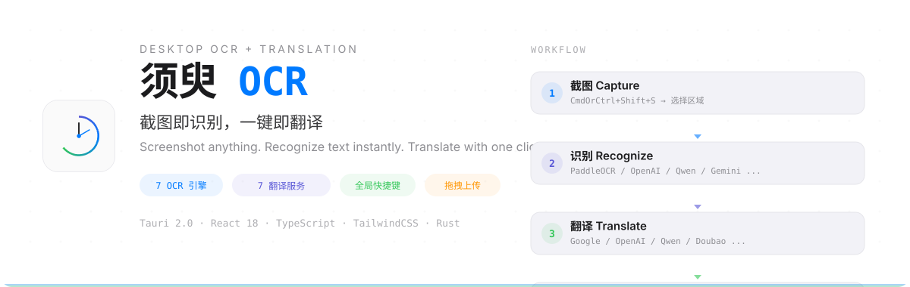

<p align="center">
  
</p>

<p align="center">
  
  
  
  
  
</p>

---

**须臾OCR** (MomentOCR) 是一款轻量级桌面端 OCR + 翻译工具。截图选定区域，7 个识别引擎任选其一，7 个翻译服务一键直达，识别结果即时复制到剪贴板 — 全程无需离开键盘。

## 功能亮点

- **截图识别** — 全局快捷键唤起截图，Snipaste 风格全屏遮罩，拖拽框选区域即刻识别
- **7 大 OCR 引擎** — PaddleOCR（本地）、OpenAI GPT-4V、通义千问VL、智谱GLM-4V、豆包视觉、Gemini、Ollama（本地大模型）
- **7 大翻译服务** — Google 翻译（免费）、OpenAI、通义千问、智谱清言、豆包、Gemini、自定义 API
- **文件上传** — 支持拖拽或文件选择器，兼容 PNG、JPG、GIF、WebP、BMP 格式
- **结果可编辑** — 字体、字号、对齐方式均可配置，一键复制到剪贴板
- **全面可定制** — 快捷键、OCR/翻译引擎、代理设置、开机自启、系统托盘一应俱全

## 工作流程

```
截图 Capture  →  识别 Recognize  →  翻译 Translate  →  复制 Copy
   ↑                                                    ↓
   └────────────── 全局快捷键 CmdOrCtrl+Shift+S ──────────┘
```

## 支持的引擎

| OCR 引擎 | 类型 | 依赖 |
| --- | --- | --- |
| PaddleOCR | 本地 | Python + PaddlePaddle |
| OpenAI GPT-4V | 云端 API | API 密钥 |
| 通义千问VL | 云端 API | DashScope 密钥 |
| 智谱 GLM-4V | 云端 API | ZhipuAI 密钥 |
| 豆包视觉 | 云端 API | 火山引擎密钥 |
| Gemini | 云端 API | Google API 密钥 |
| Ollama | 本地 | Ollama + 视觉模型 |

| 翻译服务 | 类型 | 依赖 |
| --- | --- | --- |
| Google 翻译 | 免费 | 无需配置 |
| OpenAI | 云端 API | API 密钥 |
| 通义千问 | 云端 API | DashScope 密钥 |
| 智谱清言 | 云端 API | ZhipuAI 密钥 |
| 豆包 | 云端 API | 火山引擎密钥 |
| Gemini | 云端 API | Google API 密钥 |
| 自定义 API | OpenAI 兼容 | 任意兼容端点 |

## 安装

### 前置依赖

- [Node.js](https://nodejs.org/) 18+
- [Rust](https://www.rust-lang.org/tools/install)（Tauri 编译需要）
- [Tauri 环境要求](https://v2.tauri.app/start/prerequisites/)

### 开发模式

```bash
# 克隆仓库
git clone https://github.com/your-username/MomentOCR.git
cd MomentOCR

# 安装依赖
npm install

# 启动开发模式
npm run tauri dev
```

### 构建发布

```bash
npm run tauri build
```

构建产物位于 `src-tauri/target/release/bundle/`。

## 配置说明

所有设置均可在应用内「设置」面板（7 个标签页）中调整：

| 标签页 | 控制项 |
| --- | --- |
| 常规 | 开机自启、截图选项、识别后行为 |
| 配置 | 文本样式、字体、对齐方式、字数统计 |
| 截图 | 保存路径、格式、自动保存、多屏幕 |
| 接口 | OCR 引擎选择、API 密钥、Base URL、模型 |
| 快捷键 | 自定义全局热键，支持实时按键捕获 |
| 更新 | 通过 GitHub Releases 检查版本更新 |
| 关于 | Logo、版本信息 |

## 技术栈

| 层级 | 技术 |
| --- | --- |
| 框架 | [Tauri 2.0](https://tauri.app/) |
| 前端 | React 18 + TypeScript + Vite |
| 样式 | TailwindCSS 4 |
| 状态管理 | Zustand |
| 后端 | Rust（reqwest、tokio、screenshots） |
| 图标 | 自定义时钟主题 Logo |

## 开源协议

MIT
